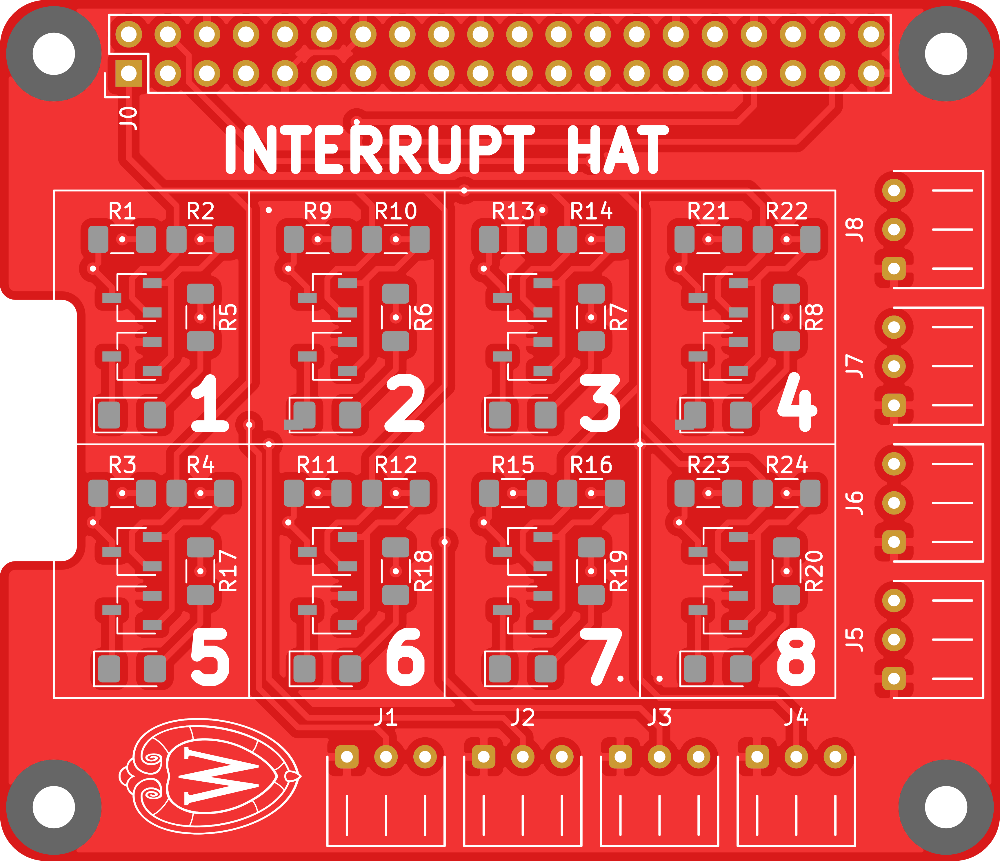
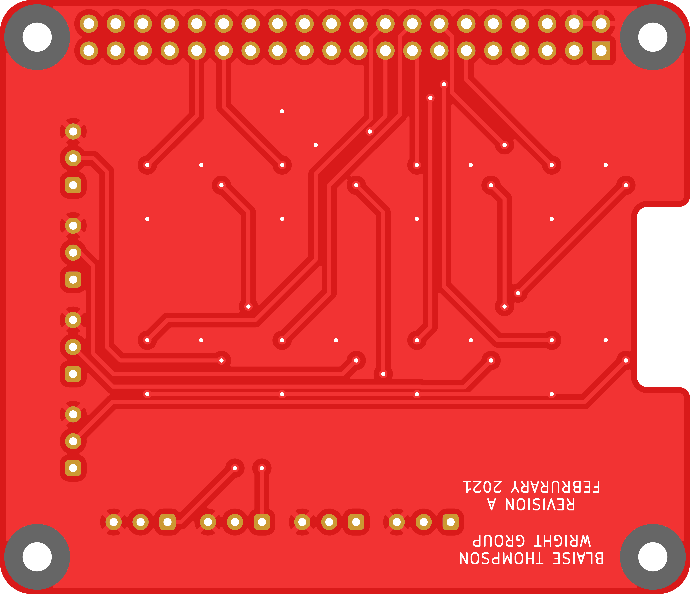

# interrupt-hat

A Raspberry Pi hat to connect GPIO to powered interrupts with onboard indicators.

## PCB

This PCB was designed using KiCAD version 5.
Refer to `interrupt-hat.pdf` for schematic.
PCB images generated with [tracespace](https://github.com/tracespace/tracespace) follow.

Bill of Materials

| reference      | value          | manufacturer | part number          | vendors |
| :------------- | :------------- | :----------- | :------------------- | :------ |

## Changelog

### Revision A

#### Added
- initial design

